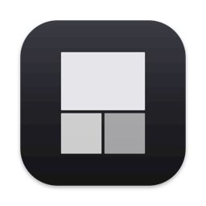
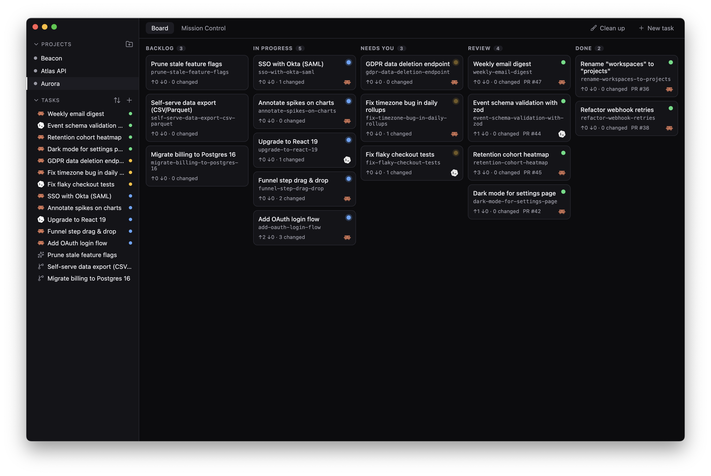
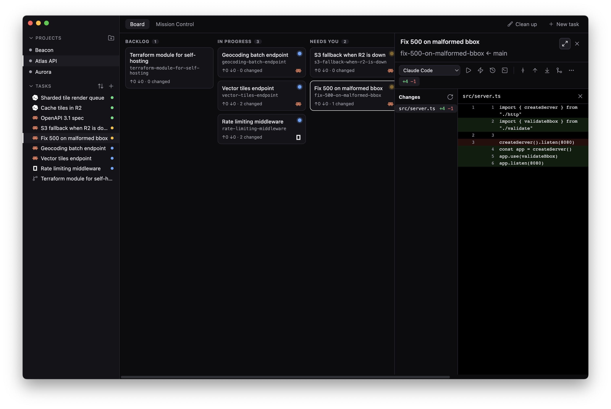
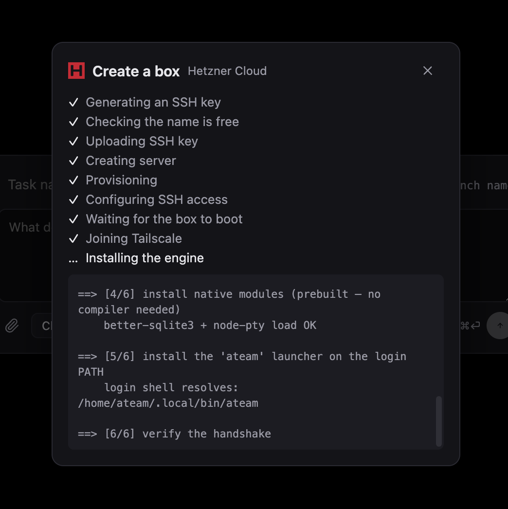

<p align="center">
  
</p>

<h1 align="center">Ateam</h1>

<p align="center">
  Orchestrate a crew of AI coding agents — Claude Code, OpenCode, and
  Codex — each isolated in its own git worktree.
</p>

<p align="center">
  <a href="https://github.com/clawnify/ateam/releases/latest/download/Ateam-macos.dmg">
    
  </a>
</p>

<p align="center">
  
</p>

<p align="center">
  
</p>

A lean desktop app to orchestrate a crew of AI coding agents
(Claude Code, OpenCode, Codex) in parallel — each isolated in its own **git
worktree**, organized by project, with built-in commit/push/pull/merge that
**never disturbs another worktree's checkout**, and a Mission Control grid to
watch several agents work at once.

Identity and all GitHub operations come from the `gh` CLI.

> **Install:** grab the signed & notarized DMG above (or any release from the
> [Releases](https://github.com/clawnify/ateam/releases) page), drag Ateam to
> Applications, and open it — no Gatekeeper warnings. Or run from source (see
> [Develop](#develop)).

## Requirements

- **Bun** ≥ 1.3 (`brew install oven-sh/bun/bun`)
- **git** ≥ 2.31, **gh** (authenticated: `gh auth status`)
- At least one agent CLI on PATH: `claude`, `opencode`, or `codex`

> Note: if your `node` is x86_64 (Rosetta) while Bun + Electron are arm64, the
> desktop dev/build scripts run under Bun's runtime (`bunx --bun`) so the right
> native binaries are used. After `bun install`, native modules are rebuilt for
> Electron via `bun run --filter @ateam/desktop rebuild`.

## Layout

```
packages/git-core   Safe worktree + git engine (no Electron, fully unit-tested)
packages/db         Local SQLite (Drizzle + better-sqlite3); bun:sqlite in tests
packages/agents     Agent registry (claude/opencode/codex) + availability probe
packages/protocol   Transport-agnostic RPC contract + client API (the shared wire)
packages/server     Headless engine + daemon: run agents on a box over SSH / WebSocket
packages/panes      Pane/split layout types
apps/desktop        Electron + React app (main · preload · renderer)
apps/mobile         iOS client (Expo / React Native) — drive a box from your phone
skills/             Claude Code skills for Ateam users (installable, see below)
```

## Run your agents on a server

Ateam is local-first, but the same desktop app can point at a Linux box that runs the
agents while your Mac stays a thin UI — over SSH on your Tailscale network, with no
public ports. On the box:

```bash
curl -fsSL https://raw.githubusercontent.com/clawnify/ateam/main/packages/server/scripts/install.sh | bash
```

**No box yet?** Ateam can create one for you — pick a region and size, and it provisions
the VPS, generates the SSH key, joins Tailscale, and installs the engine, with no
provider console or terminal to touch. Or set the box up yourself with the recipes
below — via a **box provider** like [boxd](https://boxd.sh), or your own VPS.

<p align="center">
  
</p>

<details>
<summary><b>Start to finish on a fresh Hetzner box</b></summary>

Create a **CX23** (x86) or **CAX11** (Arm64) — both 2 vCPU / 4 GB / 40 GB — on
Ubuntu, with your SSH key attached. Agents are what eat the RAM: roughly a gigabyte
per concurrent session, plus whatever your project's dev server and tests need.

**First, on your Mac:** install Tailscale ([tailscale.com/download](https://tailscale.com/download))
and sign in. The box and — if you use it — your phone sign into that same account;
that private network is what lets you close the server's public SSH port entirely.

**Then as `root` on the box,** make a user for the agents and join the same tailnet:

```bash
adduser --gecos "" you && usermod -aG sudo you
install -d -m 700 -o you -g you /home/you/.ssh
cp ~/.ssh/authorized_keys /home/you/.ssh/ && chown you:you /home/you/.ssh/authorized_keys

curl -fsSL https://tailscale.com/install.sh | sh && tailscale up   # opens a sign-in URL
tailscale ip -4                       # → 100.x.y.z
```

**Reconnect as that user over the tailnet** — `ssh you@100.x.y.z` — and only once
that works, close the public door. Allow the whole `tailscale0` interface, not just
port 22: `ufw`'s default input policy is DROP, so a port-22-only rule would block the
port the iOS app needs.

```bash
sudo ufw allow in on tailscale0 && sudo ufw deny 22 && sudo ufw enable
```

**Then set the box up for agents.** Ateam commits, pushes and opens PRs as this user,
so it needs a real git identity and a logged-in `gh`:

```bash
sudo apt install -y git gh
git config --global user.name "you" && git config --global user.email "you@example.com"
git config --global init.defaultBranch main
gh auth login                                     # device code — works over SSH

curl -fsSL https://claude.ai/install.sh | bash    # then run `claude` once to log in

curl -fsSL https://raw.githubusercontent.com/clawnify/ateam/main/packages/server/scripts/install.sh | bash
```

The installer ends with a readiness report — every line should be `[ok]`. Finally, on
your **Mac**, add the box to `~/.ssh/config` with `HostName 100.x.y.z` and pick it in
Ateam's connection switcher.

**Also using the iOS app?** The phone can't start a daemon the way the desktop does
over SSH, so install a service to keep one running:

```bash
export ATEAM_WS_ADDR=100.x.y.z:8787               # the box's OWN Tailscale IP
curl -fsSL https://raw.githubusercontent.com/clawnify/ateam/main/packages/server/scripts/install.sh | bash -s -- --service
```

</details>

<details>
<summary><b>Use a box provider — boxd (and services like it)</b></summary>

Some services create a box for you and write an SSH alias straight into your
`~/.ssh/config`. Ateam offers any alias it finds there, so a box provider needs **no
Ateam-side integration** — the recipe is always the same: create a box with the
provider's CLI, run Ateam's `install.sh` on it over that alias, sign into `gh` and your
agent, then pick the alias in the connection switcher.

Per-provider recipes live in [`docs/providers/`](docs/providers/) — what's
preinstalled, how git credentials work, whether the phone can reach it, and the
gotchas. **[boxd](https://boxd.sh)** is the first one
([recipe](docs/providers/boxd.md)); the same steps fit any service that registers an
ssh_config host, and [adding one](docs/providers/#adding-a-provider) is a docs-only PR.

<a href="https://boxd.sh"></a>

</details>

Full walkthrough, from a freshly bought VPS to a connected board:
[`docs/online-ateam.md`](docs/online-ateam.md). If you use Claude Code, it can do the
whole setup with you:

```
/plugin marketplace add clawnify/ateam
/plugin install ateam@ateam
```

## Develop

```bash
bun install
bun run --filter @ateam/desktop rebuild   # native modules for Electron (arm64)
bun run --filter @ateam/desktop dev        # launch the app (Electron + Vite HMR)
```

The renderer's dev port is derived from the worktree path (and bound to
`127.0.0.1`), so several worktrees can run `dev` side by side without serving
each other's code. The URL is printed on startup.

## Test & typecheck

```bash
bun test             # git-core + db
bun run typecheck    # all packages
bun run --filter @ateam/desktop build      # production bundle
```

## How the safe git model works

- One worktree per task, co-located at `<repo>/.ateam/worktrees/<slug>` (excluded
  via `.git/info/exclude`, so it never pollutes the project's own status).
- **1 worktree : 1 branch** — we never `checkout`/`switch` a branch inside an
  existing worktree. Every mutation is `git -C <worktree>`-scoped.
- **Merge** goes through `gh pr merge` (remote-side, touches no local checkout),
  then auto-updates local `main` safely: a direct ref fast-forward when `main`
  isn't checked out anywhere, or `merge --ff-only` inside `main`'s own worktree
  when it is — aborting rather than clobbering if `main` diverged.

## Status

Working: project registration (with optional `git init` for plain folders),
worktree-per-task lifecycle, commit/push/update/merge, a GitHub-style changes
view (aggregate diffstat → file list + side-by-side diffs), prompt-first task
composer (pick the agent and type the first instruction in one step) reused for
extra sessions inside an existing task, many terminals per task as tabs (agent
sessions or plain shells, side by side), agent spawning in PTYs (Claude Code,
OpenCode, Codex), hook-driven status → kanban columns with merged-PR detection,
<<<<<<< HEAD
Mission Control grid, collapsible sidebar rail, image drag-drop & paste into
=======
Mission Control grid (one tile per task, its sessions as read-only tabs),
collapsible sidebar rail, image drag-drop & paste into
>>>>>>> origin/main
agent terminals, session search (describe past work in the topbar and jump back
to the session that did it, reading Claude Code / Codex / OpenCode transcripts),
safe cleanup of merged worktrees, and signed/notarized builds
with in-app auto-update. The git engine and db layer are unit-tested; the
Electron main process is boot-verified with native modules.

## Roadmap

- **Transcript → tasks** — paste a meeting transcript or a long task summary
  and let Claude Code (headless, in the background) distribute it into tasks
  automatically.
- Integrations (Linear / Slack / GitHub issues) with **no paywall** — exposed to
  every agent via MCP, brokered through Composio/Arcade.
- Session-history continuity across worktrees ("fork session").

## Privacy

Local-first, no backend, no analytics: see **[PRIVACY.md](./PRIVACY.md)**.

## License

Dual-licensed: **[GPL-3.0-or-later](./LICENSE)** for open source use — or a
**commercial license** for organizations that can't comply with the GPL
(contact [Clawnify](https://github.com/clawnify)). © 2026 Clawnify
